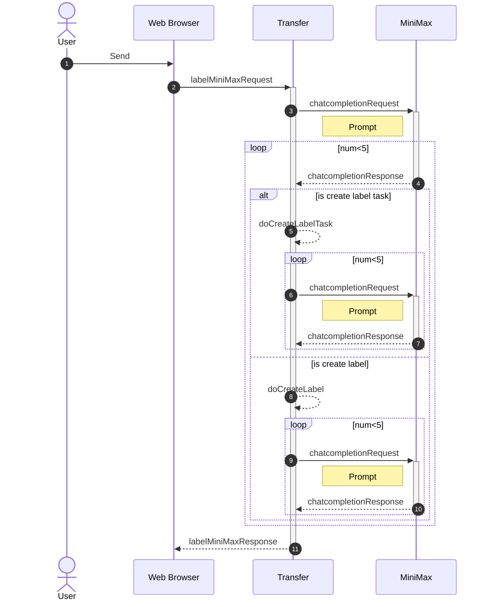

### labelchat 时序图

```mermaid
sequenceDiagram
	autonumber
	actor User	
    participant web as Web Browser
    participant Transfer
    participant MiniMax
    
    User->>web: Send
    web->>+Transfer: labelMiniMaxRequest
    Transfer->>+MiniMax: chatcompletionRequest
    Note left of MiniMax: Prompt
    loop num<5
    	MiniMax-->>-Transfer: chatcompletionResponse
        alt is create label task
        	Transfer-->>Transfer: doCreateLabelTask
        	loop num<5
                Transfer->>+MiniMax: chatcompletionRequest                
    			Note left of MiniMax: Prompt
                MiniMax-->>-Transfer: chatcompletionResponse
            end
        else is create label
            Transfer-->>Transfer: doCreateLabel
            loop num<5
            	Transfer->>+MiniMax: chatcompletionRequest            	
    			Note left of MiniMax: Prompt
            	MiniMax-->>-Transfer: chatcompletionResponse
            end
        end
      end
      Transfer-->>-web: labelMiniMaxResponse
```

