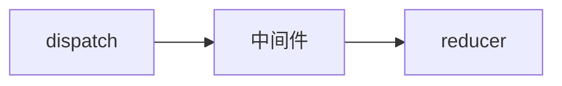

[TOC]


## 一、安装

1. 安装脚手架	`npm install -g create-react-app`
2. 创建项目 `create-react-app 项目名  `

## 二、基础语法

### 1.Hello World

```html
<div id="root">root</div>

<!-- 1.引入 react react-dom -->
<script crossorigin src="https://unpkg.com/react@17/umd/react.production.min.js"></script>
<script crossorigin src="https://unpkg.com/react-dom@17/umd/react-dom.production.min.js"></script>

<!-- 2.引入 babel 用于解析 JSX -->
<script src="https://unpkg.com/@babel/standalone/babel.min.js"></script>

<!-- 3.在 script 标签中添加 type="text/babel" -->
<script  type="text/babel">
            ReactDOM.render(
                  <h1>Hello, world!</h1>,
                  document.getElementById('root')
            );
</script>
```


### 2.JSX 简介

### 3.容器组件 vs 展示组件

#### 1.不区分的情况

```javascript
// CommentList.js

import React from 'react'
class CommentList extends React.Component {
    constructor(props) {
        super(props)
        this.state = {
            comments: []
        }
    }

    componentDidMount() {
        setTimeout(
            this.setState({
                comments: ['嘿嘿', '哈哈', '呼呼']
            }), 3000)
    }

    render() {
        return (
            <div>
                <p>容器组件 和 展示组件不分离的情况</p>
                <ul>
                    {this.state.comments.map(this.renderComment)}
                </ul>
            </div>
        )
    }

    renderComment = (v) => {
        return (
            <li key={v}>{v}</li>
        )
    }
}
```

#### 2.区分的情况

```javascript
// CommentListContainer.js

import CommentListUI from './CommentListUI'

class CommentListContainer extends React.Component {
    constructor(props) {
        super(props)
        this.state = {
            comments: []
        }
    }

    componentDidMount() {
        setTimeout(
            this.setState({
                comments: ['嘿嘿', '哈哈', '呼呼']
            }), 3000)
    }

    render() {
        return (
            <div>
                <CommentListUI comments={this.state.comments}></CommentListUI>
            </div>
        )
    }
}

// CommentListUI.js

class CommentListUI extends React.Component {
    constructor(props) {
        super(props)
    }

    render() {
        return (
            <div>
                <p>容器组件 和 展示组件 分开啦~~</p>
                <ul>
                    {this.props.comments.map(this.renderComment)}
                </ul>
            </div>
        )
    }

    renderComment = (v) => {
        return (
            <li key={v}>{v}</li>
        )
    }
}

```

#### 3.二者区别

| 容器组件（Smart/Container Components）                       | 展示组件（Dumb/Presentational Components）                   |
| ------------------------------------------------------------ | ------------------------------------------------------------ |
| 关注事务如何工作                                             | 关注事务的展示                                               |
| 可能包含展示和容器组件，并且不会有 DOM 标签和 CSS 样式       | 可能包含展示和容器组件，并且一般会有 DOM 标签和 CSS 样式     |
| 提供数据和行为给容器组件或其他展示组件                       | 常常允许通过 this.props.children 传递                        |
| 调用 flux action 并且提供他们的回调给展示组件                | 对第三方没有任何依赖，比如 store 或者 flux action            |
| 作为数据源，通常采用较高阶的组件，而不是自己写，比如 React Redux 的 connect() , Relay 的 createContainer() , Flux Utils 的 Container.create() | 不要指定数据如何加载和变化                                   |
|                                                              | 仅通过属性获取数据和回调                                     |
|                                                              | 很少有自己的状态，即使有，也是自己的UI状态                   |
|                                                              | 除非他们需要自己的状态，生命周期，或性能优化，才会被写为功能组件 |

#### 4.容器组件和展示组件分离的好处

1. 展示和容器更好的分离，更好的理解应用程序和UI。
2. 重用性高，展示组件可以用于多个不同的 state 数据源。


## 三、高级指引

### 1.高阶组件 HOC

​	高阶组件HOC（`higherOrderComponent`）是 React 中用于复用组件逻辑的一种高级技巧。HOC自身不是 React API 的一部分，它是一种基于 React 的组合特性而形成的设计模式。

​	具体而言，**高阶组件是参数为组件，返回值为新组件的函数。约定以  `with` 开头，可链式调用。**

```javascript
const EnhancedComponent = higherOrderComponent(WrappedComponent);
```

​	组件是将 props 转换为 `UI`，而高阶组件是将组件转换为另一个组件。

#### 1.场景一：为组件增加属性(函数组件)

```javascript
class WrappedComponent extends React.Component {
    state = {
        list: ['foo', 'bar']
    }

    render() {
        return (
            <div>
                <ul>
                    {this.state.list.map(v => <li key={v}>{v}</li>)}
                </ul>
            </div>
        )
    }
}

// hoc 
// 是一个函数
// 参数是一个组件
// 返回值是一个新组件
const withBaz = (Component) => {
    // 函数组件
    const newCopm = (props) => {
        return <Component {...props} baz='baz' />
    }
    return newCopm
}

const EnhancedComponent = withBaz(wrappedComponent)
```

#### 2.场景二：日志组件（类组件）

```javascript
const withLog = Component => {
    // 类组件
    class NewComponent extends React.Component {
        componentWillMount() {
            console.time(`CompoentRender`)
            console.log(`准备完毕了`)
        }
        render() {
            return <Component {...this.props}></Component>
        }

        componentDidMount() {
            console.timeEnd(`CompoentRender`)
            console.log(`渲染完毕了`)
        }
    }
    return NewComponent
}

// hoc 可以链式调用
const LogEnhancedComponent = withLog(withBaz(wrappedComponent))
```

#### 3.装饰器模式

需要先安装一个插件，用来支持 `@` 装饰器语法：

如果您用的是 Babel >= 7.x ，请按照下文[安装](https://babeljs.io/docs/en/babel-plugin-proposal-decorators.html)：

```
// 安装(Babel >= 7.x)
npm install --save-dev @babel/plugin-proposal-decorators

// 配置(.babelrc)
{
  "plugins": [
    ["@babel/plugin-proposal-decorators", { "legacy": true }],
  ]
}

// 使用
@annotation
class MyClass { }
```

如果您用的是 Babel 6.x ，请按照下文[安装](https://www.npmjs.com/package/babel-plugin-transform-decorators-legacy)：

```
// 安装(Babel 6.x)
npm install --save-dev babel-plugin-transform-decorators-legacy

// 配置(.babelrc)
{
    "plugins": ["transform-decorators-legacy"]
}
```

#### 4.为什么不用Mixins

[Mixins Considered Harmful](https://zh-hans.reactjs.org/blog/2016/07/13/mixins-considered-harmful.html)

## 四、组件通信

### 1.context

​	Context 提供了一个无需为每层组件动手添加 props ，就能在组件树间进行数据传递的方法。

​	在一个典型的 React 应用中，数据是通过 `props` 属性自上而下（由父及子）进行传递的，但这种做法对于某些类型的属性而言是极其繁琐的（例如：地区偏好，UI主题），这些属性是应用程序中许多组件都需要的。 Context 提供了一种在组件之间共享此类值的方式，而不必显示的通过组件树的逐层传递 props 。

​	使用时，

​	通过 `const { Provider, Consumer } = React.createContext()` 创建 Context 对象；

​	Provider 接收一个 `value` 属性，传递给消费组件；

​	Consumer 需要一个[函数作为子元素（function as a child）](https://zh-hans.reactjs.org/docs/render-props.html#using-props-other-than-render)。这个函数接收当前的 context 值，并返回一个 React 节点。

```javascript
// 1.创建 Context 对象
const { Provider, Consumer } = React.createContext()

// 2.使用 Provider 提供数据
<Provider value="dark">
	<ContextB />
</Provider>

// 3.使用 Consumer 渲染数据
<Consumer>
	/* 注意此处是函数 */
  	{value => /* 基于 context 值进行渲染*/}
</Consumer>
```

### 2.redux

​	[Redux](https://cn.redux.js.org/) 是 Javascript 状态容器，提供可预测化的状态管理。可以让你构建一致化的应用，运行于不同的环境（客户端、服务器、原生应用），并且易于测试。

#### 1.安装

​	`npm install redux --save`

#### 2.简介

​	`store` 具有全局唯一性。通过`store.subscribe()`监听。

```javascript
// 每次 dispatch 都会触发 subscribe 监听函数

store.subscribe(render)
```

#### 3.入门小栗子

- store.js

  ```javascript
  // 数据中心
  import { createStore } from 'redux'
  
  // 实际干活等工人
  // 返回 state ，而不修改数据
  const counterReducer = (state = 0, action) => {
      // dispatch 把数据提交到这里
      // {type:'add'}
      switch (action.type) {
          case 'add':
              return state + 1;
          case 'minus':
              return state - 1;
          default:
              return state
      }
  }
  
  // 创建一个仓库
  const store = createStore(counterReducer)
  export default store
  ```

- App.js

  ```javascript
  import React from 'react';
  
  import store from './store'
  
  class ReduxApp extends React.Component {
      render() {
          return (
              <div>
                  <hr />
                  <h3>组件通信：Redux</h3>
                  <p>{store.getState()}</p>
                  <div>
                      {/* dispatch 把数据传递给 reducer */}
                      <button onClick={() => store.dispatch({ type: "add" })}>+</button>
                      <button onClick={() => store.dispatch({ type: "minus" })}>-</button>
                  </div>
              </div>
          )
      }
  }
  
  
  export default ReduxApp
  ```

- index.js

  ```javascript
  import React from 'react'
  import ReactDOM from 'react-dom';
  import App from './App'
  import store from './store';
  
  const render = () => {
      ReactDOM.render(
          <App></App>,
          document.getElementById("redux")
      )
  }
  render()
  
  // 每次 dispatch 都会触发 subscribe 监听函数
  store.subscribe(render)
  
  ```

### 3.react-redux

#### 1.安装

​	`npm install react-redux --save`

#### 2.API

- `<Provider store>`；顶级组件，提供数据。

- `connect([mapStateToProps], [mapDispatchToProps], [mergeProps], [options])(App)`；高阶组件，提供数据和方法。

- 默认只支持同步操作


#### 3.中间件（异步有问题）


- 中间件处理**异步操作**，需引入 `redux-thunk` 库，通过 React 的`applyMiddleware` 方法引入。返回的是一个函数

  ```javascript
  // 安装
  npm install --save redux-thunk
  
  import { createStore, applyMiddleware } from 'redux'
  import thunk from 'react-thunk'
  
  // 创建一个仓库
  const store = createStore(rootReducer, applyMiddleware(thunk))
  
  // 使用
  
  ```

- logger 日志，使用 `redux-logger` 库

  ```javascript
  // 安装
  npm i --save redux-logger
  
  // 使用
  import { createStore, applyMiddleware } from 'redux'
  import logger from 'redux-logger'
  const store = createStore(rootReducer, applyMiddleware(logger))
  ```

#### 4.多个Reducer

- 多个 reducer，需通过 React 的`combineReducers`方法引入。

  ```javascript
  import { createStore, combineReducers } from 'redux'
  
  // 创建一个仓库
  const rootReducer = combineReducers({ counterReducer1, counterReducer2 })
  const store = createStore(rootReducer)
  
  // 使用
  @connect(
      state => ({ num: state.counterReducer1 }),/* 此处相当于增加了命名空间counterReducer1 */
      {
          addAction,
          minusAction
      }
  )
  ```


#### 5.入门小栗子

- store.js

  ```javascript
  // 数据中心
  import { createStore } from 'redux'
  
  // 实际干活等工人
  // 返回 state ，而不修改数据
  const counterReducer = (state = 0, action) => {
      // dispatch 把数据提交到这里
      // {type:'add'}
      switch (action.type) {
          case 'add':
              return state + 1;
          case 'minus':
              return state - 1;
          default:
              return state
      }
  }
  
  // 创建一个仓库
  const store = createStore(counterReducer)
  export default store
  ```

- App.js

  ```javascript
  import React from 'react';
  
  import { connect } from 'react-redux'
  
  // connect 局部组件 提供数据和方法
  // 参数一：组件需要哪些数据
  // 参数二：组件需要哪些方法 dispatch
  
  @connect(
      state => ({ num: state }),
      // dispatch => ({
      //     add: () => dispatch({ type: "add" }),
      //     minus: () => dispatch({ type: "minus" })
      // })
      // 同步的 dispatch 是可以简写的 返回一个 object
      {
          add: () => ({ type: "add" }),
          minus: () => ({ type: "minus" })
      }
  )
  class ReactReduxApp extends React.Component {
      render() {
          return (
              <div>
                  <hr />
                  <h3>组件通信：react-Redux</h3>
                  <p>{this.props.num}</p>
                  <div>
                      {/* dispatch 把数据传递给 reducer */}
                      <button onClick={() => this.props.add()}>+</button>
                      <button onClick={() => this.props.minus()}>-</button>
                  </div>
              </div>
          )
      }
  }
  
  // // 1.需要到参数
  // const mapStateToProps = (state) => ({
  //     num: state
  // })
  
  // // 2.需要到方法
  // const mapDispatchToProps = (dispatch) => {
  //     return {
  //         add: () => dispatch({ type: "add" }),
  //         minus: () => dispatch({ type: "minus" })
  //     }
  // }
  
  // // 3.连接 redux 和 react
  // ReactReduxApp = connect(mapStateToProps, mapDispatchToProps)(ReactReduxApp)
  
  
  export default ReactReduxApp
  ```

- index.js

  ```javascript
  import React from 'react'
  import ReactDOM from 'react-dom';
  import App from './App'
  
  import store from './store'
  import { Provider } from 'react-redux'
  
  ReactDOM.render(
      // Provider 顶级组件，提供数据
      <Provider store={store}>
          <App></App>
      </Provider>,
      document.getElementById("react-redux")
  )
  ```

## 五、性能优化

### 1.`React.PureComponent`

`React.PureComponent` 与 [`React.Component`](https://zh-hans.reactjs.org/docs/react-api.html#reactcomponent) 很相似。两者的区别在于 [`React.Component`](https://zh-hans.reactjs.org/docs/react-api.html#reactcomponent) 并未实现 [`shouldComponentUpdate()`](https://zh-hans.reactjs.org/docs/react-component.html#shouldcomponentupdate)，而 `React.PureComponent` 中以 **浅层** 对比 prop 和 state 的方式来实现了该函数。

如果赋予 React 组件相同的 props 和 state，`render()` 函数会渲染相同的内容，那么在某些情况下使用 `React.PureComponent` 可提高性能。

> 注意
>
> `React.PureComponent` 中的 `shouldComponentUpdate()` 仅作对象的浅层比较。如果对象中包含复杂的数据结构，则有可能因为无法检查深层的差别，产生错误的比对结果。仅在你的 props 和 state 较为简单时，才使用 `React.PureComponent`，或者在深层数据结构发生变化时调用 [`forceUpdate()`](https://zh-hans.reactjs.org/docs/react-component.html#forceupdate) 来确保组件被正确地更新。你也可以考虑使用 [immutable 对象](https://facebook.github.io/immutable-js/)加速嵌套数据的比较。
>
> 此外，`React.PureComponent` 中的 `shouldComponentUpdate()` 将跳过所有子组件树的 prop 更新。因此，请确保所有子组件也都是“纯”的组件。

### 2.`React.memo`

```javascript
const MyComponent = React.memo(function MyComponent(props) {
  /* 使用 props 渲染 */
});
```

`React.memo` 为[高阶组件](https://zh-hans.reactjs.org/docs/higher-order-components.html)。

如果你的组件在相同 props 的情况下渲染相同的结果，那么你可以通过将其包装在 `React.memo` 中调用，以此通过记忆组件渲染结果的方式来提高组件的性能表现。这意味着在这种情况下，React 将跳过渲染组件的操作并直接复用最近一次渲染的结果。

`React.memo` 仅检查 props 变更。如果函数组件被 `React.memo` 包裹，且其实现中拥有 [`useState`](https://zh-hans.reactjs.org/docs/hooks-state.html) 或 [`useContext`](https://zh-hans.reactjs.org/docs/hooks-reference.html#usecontext) 的 Hook，当 context 发生变化时，它仍会重新渲染。

默认情况下其只会对复杂对象做**浅层**对比，如果你想要控制对比过程，那么请将自定义的比较函数通过第二个参数传入来实现。

```javascript
function MyComponent(props) {
  /* 使用 props 渲染 */
}
function areEqual(prevProps, nextProps) {
  /*
  如果把 nextProps 传入 render 方法的返回结果与
  将 prevProps 传入 render 方法的返回结果一致则返回 true，
  否则返回 false
  */
}
export default React.memo(MyComponent, areEqual);
```

此方法仅作为**[性能优化](https://zh-hans.reactjs.org/docs/optimizing-performance.html)**的方式而存在。但请不要依赖它来“阻止”渲染，因为这会产生 bug。

> 注意
>
> 与 class 组件中 [`shouldComponentUpdate()`](https://zh-hans.reactjs.org/docs/react-component.html#shouldcomponentupdate) 方法不同的是，如果 props 相等，`areEqual` 会返回 `true`；如果 props 不相等，则返回 `false`。这与 `shouldComponentUpdate` 方法的返回值相反。

## 六、React-Router

#### 1.安装

`npm install --save react-router-dom`


## 七、UI组件库

### 1.[Ant Design](https://ant.design/docs/react/introduce-cn)

#### 1.安装

`npm install antd --save`

## 八、React 未来

### 1.Fiber

​	同步渲染 异步渲染 react团队2年开发

### 2.Suspense

​	react-cache

​	用同步代码实现异步操作

​	为解决：组件中需要有自己的 state ComponentDidMount（缺点：只能使用类组件） ;渲染两次 mount ComponentDidMount 

### 3.Hooks

​	拥抱函数式	

​	useState()

​	useEffect()