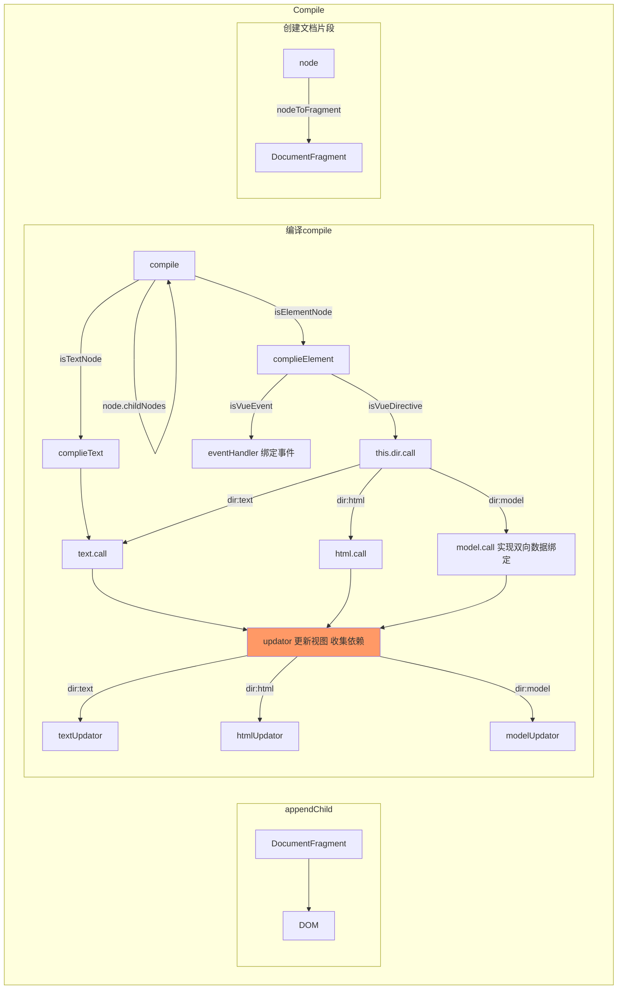
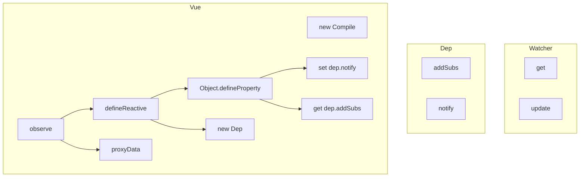

```mermaid
graph TD
	subgraph Compile
        subgraph appendChild
        E1[DocumentFragment]-->E2[DOM]
        end

        subgraph 编译compile
        B[compile]-->|isTextNode|D[complieText]
        D-->F
        B-->|isElementNode|C[complieElement]
        B-->|node.childNodes|B
        C-->|isVueEvent|E12[eventHandler 绑定事件]
        C-->|isVueDirective|E[this.dir.call]
        E-->|dir:text|F[text.call]
        E-->|dir:html|G[html.call]
        E-->|dir:model|H[model.call 实现双向数据绑定]
        F-->I[updator]
        G-->I[updator]
        H-->I[updator 更新视图 收集依赖]:::red
        I-->|dir:text|J[textUpdator]
        I-->|dir:html|K[htmlUpdator]
        I-->|dir:model|L[modelUpdator]
        end

        subgraph 创建文档片段
        S1[node]-->|nodeToFragment|S2[DocumentFragment]
        end
	end
	
	classDef red fill:#f96;
```

```mermaid
graph TD
	subgraph Watcher
	W[get]
	ww[update]
	end
	
	subgraph Dep
	d[addSubs]
	dd[notify]
	end
	
	subgraph Vue
	vaa[new Compile]
	va[observe]-->vb[defineReactive]
	vb-->vd[Object.defineProperty]
	vd-->ve[set dep.notify]
	vd-->vg[get dep.addSubs]
	vb-->vf[new Dep]
	va-->vc[proxyData]
	end
	
	classDef red fill:#f96;
```