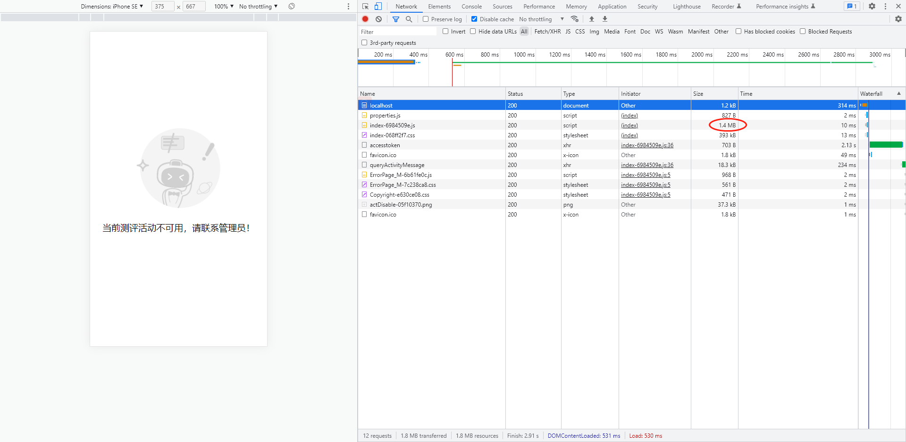

[TOC]

## 性能优化之gzip压缩


> 我们给某人发送邮件时，我们在传输之前把自己的文件压缩一下，接收方收到文件后再去解压获取文件。这中操作对于我们来说都已经司空见惯。我们压缩文件的目的就是为了把传输文件的体积减小，加快传输速度。我们在 `http` 传输中开启 `gZip` 的目的也是如此。


### 优化前




### 优化后


这里着重看`index-6984509e.js`资源，开启gzip压缩前，资源大小为1.4MB；开启gzip压缩后，资源大小仅为507kB。资源大小降到之前的**36%**。

再看首屏加载资源的总大小从1.8MB降到650kB，总体压缩率达到**35.3%**。

这里有一个小彩蛋，发现`png`，`ico`资源，压缩前后大小几乎没有发生变化！

|          | 压缩前 | 压缩后 | ratio      |
| -------- | ------ | ------ | ---------- |
| js       | 1.4MB  | 509kB  | 35.51%     |
| css      | 393kB  | 97.2kB | 24.73%     |
| img      | 37kB   | 36.5kB | 98.65%     |
| document | 986B   | 850B   | 86.21%     |
|          |        |        |            |
| 总体     | 1.8MB  | 650kB  | **35.26%** |


### 优化方式一【实时压缩】

对于服务端来进行压缩，客户端啥也不用做，只需要把打好的包放入对应的目录下面，然后在访问的时候 nginx 自动进行压缩传给客户端进行解析等。

#### nginx

nginx 有一个模块是 gzip 模块，然后你只要开启了，nginx就会帮你来把数据（静态资源 和 接口数据）进行压缩，然后传入到客户端，客户端来解压，然后在进行代码的读取，其实这一步就是节约带宽，减少传输的代码包的数量。从而节约传输时间。然后网站就能很快打开了。下面是nginx的配置：

> When using the SSL/TLS protocol, compressed responses may be subject to [BREACH](https://en.wikipedia.org/wiki/BREACH) attacks.

```javascript
// nginx.conf

http {
	...
    gzip on; // 开启gzip压缩
	gzip_types *; // 对响应的MIME types在text/html的基础上进行扩展配置，*匹配所有MIME types
	...
    // 详细的配置信息可以参考nginx官网： http://nginx.org/en/docs/http/ngx_http_gzip_module.html
}
```

此时，可以看到nginx中部署的静态资源并没有`.gz`结尾的文件资源，印证了此种压缩方式是在请求资源、接口数据时进行的是实时压缩。

	

### 优化方式二【构建时压缩】

为啥要客户端生成呢？ 问得好， 我们知道服务端实时生成是不是每一次请求都要去请求服务器，然后服务器来生成压缩包。服务器每一次生成压缩包是不是会不会浪费服务端的性能哇！ 如果客户端生成，服务端先判断是否存在的后缀名为zip的文件，直接去拿，不存在在来压缩，这样是不是把服务器每一次都要压缩的事情，交给客户端了呢？ 虽然客户端打包进行代码压缩会很慢。 但是我们打包只是发布代码的时候打一次包，而服务器是要面对成千上万的人来访问等。 说到这里大家应该明白了吧。

注意：这里nginx 也要配置， 配置启动gzip模块， 然后优先使用本地压缩好的文件。

```javascript
// nginx.conf

http {
	...
    gzip_static  on; // 开启gzip_static压缩
	...
    // 详细的配置信息可以参考nginx官网： http://nginx.org/en/docs/http/ngx_http_gzip_static_module.html
}
```

下面是部署在nginx里的资源：


在客户的压缩工具也有很多，这里我就介绍webpack 和 vite 客户端怎么进行压缩然后部署。

#### webpack

大众使用的是这个工具，在压缩的时候，使用上面提到的那个压缩插件[`compression-webpack-plugin`](https://www.npmjs.com/package/compression-webpack-plugin)。然后在 vue.config.js 或者 webpack.config.js 里面加入插件的配置信息。

```javascript
// 这里使用的 vue.config.js, webpack.config.js 里面内容大部分相同，只是vue.config.js里面是链式调用的。
  const compressionWebpackPlugin = require('compression-webpack-plugin')
  configureWebpack: {
    plugins: [new compressionWebpackPlugin({
      filename: '[path].gz[query]', //压缩后的文件名
      algorithm: 'gzip', // 压缩格式 有：gzip、brotliCompress,
      test: /\.(js|css|svg)$/,
      threshold: 10240,// 只处理比这个值大的资源，按字节算
      minRatio: 0.8, //只有压缩率比这个值小的文件才会被处理，压缩率=压缩大小/原始大小，如果压缩后和原始文件大小没有太大区别，就不用压缩
      deleteOriginalAssets: false //是否删除原文件，最好不删除，服务器会自动优先返回同名的.gzip资源，如果找不到还可以拿原始文件
    })],
```

#### vite

本人项目是使用vite来进行构建的，这里也需要安装一个插件，[vite-plugin-compression](https://www.npmjs.com/package/vite-plugin-compression) 使用方式很简单。

```javascript
// vite.config.ts

import viteCompression from 'vite-plugin-compression';

// https://vitejs.dev/config/
export default defineConfig({
  plugins: [
      ...
      viteCompression({
          verbose: true, // 默认即可
          disable: false, //开启压缩(不禁用)，默认即可
          deleteOriginFile: false, //删除源文件
          threshold: 10240, //压缩前最小文件大小
          algorithm: 'gzip', //压缩算法
          ext: '.gz', //文件类型
      })
      ...
  ],
})
```


### 扩展

> nginx命令
>
> `nginx -s reload`：修改配置后，重新加载；
>
> `tasklist /fi "imagename eq nginx.exe"`： 查看占用的进程；
>
> `taskkill /t /f /im 进程号`： 杀死进程；


### 参考资料

1. 服务端压缩nginx-gzip：[ngx_http_gzip_module](http://nginx.org/en/docs/http/ngx_http_gzip_module.html)；
2. 服务端压缩nginx-gzip-static：[ngx_http_gzip_static](http://nginx.org/en/docs/http/ngx_http_gzip_static_module.html)；
3. 服务端压缩：[ngx_http_gunzip_module](https://nginx.org/en/docs/http/ngx_http_gunzip_module.html)；
4. 客户端压缩webpack：[compression-webpack-plugin](https://www.npmjs.com/package/compression-webpack-plugin)；
5. 客户端压缩vite：[vite-plugin-compression](https://www.npmjs.com/package/vite-plugin-compression)；

