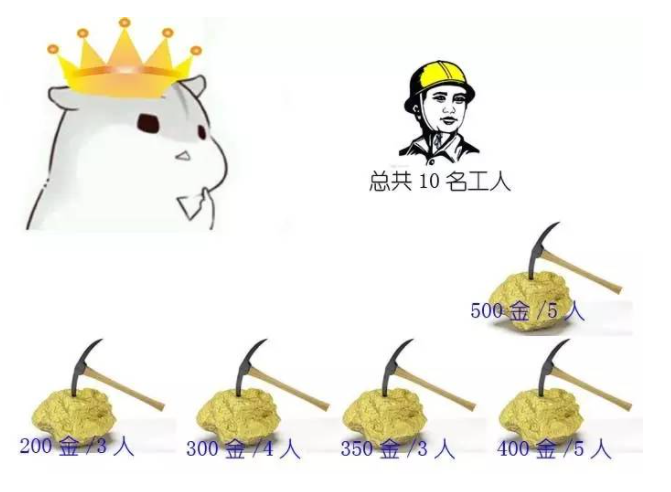

动态规划中三个重要的概念：【最优子结构】、【边界】、【状态转移公式】

#### **题一、爬楼问题（一个维度）：**

有一座高度是**10**级台阶的楼梯，从下往上走，每跨一步只能向上**1**级或者**2**级台阶。要求用程序来求出一共有多少种走法。

##### 问题建模

- 最优子结构：F(9)、F(8)
- 边界：F(1)、F(2)
- 状态转移方程：F(n) = F(n-1) + F(n-2)

##### 求解问题

- 递归求解：时间复杂度O(2^n)

  > 递归求解的时间复杂度是指数级的。

  ```javascript
  // 递归求解
  function getClimbingWays(n) {
      if (n < 1) {
          return 0;
      }
      if (n === 1) {
          return 1
      }
      if (n === 2) {
          return 2
      }
      return getClimbingWays(n - 1) + getClimbingWays(n - 2)
  }
  ```

  

- 备忘录算法：时间复杂度O(n)、空间复杂度O(n)

  ```javascript
  // 备忘录算法：增加了缓存
  function getClimbingWays2(n) {
      let map = new Map();
      if (n < 1) {
          return 0;
      }
      if (n === 1) {
          return 1
      }
      if (n === 2) {
          return 2
      }
      if (map.has(n)) {
          return map.get(n)
      } else {
          let value = getClimbingWays2(n - 1) + getClimbingWays2(n - 2);
          map.set(n, value)
          return value
      }
  }
  ```

  

- 动态规划:时间复杂度O(n)、空间复杂度O(1)

  ```javascript
  // 动态规划：自底向上计算，可只缓存2个数据
  function getClimbingWays3(n) {
      if (n < 1) {
          return 0;
      }
      if (n === 1) {
          return 1
      }
      if (n === 2) {
          return 2
      }
  
      let a = 1;
      let b = 2;
      let temp = 0;
  
      for (let i = 3; i <= n; i++) {
          temp = a + b;
          [a, b] = [b, temp]
      }
      return temp;
  }
  ```

  

#### **题二、工人挖矿问题（两个维度）：**

​	有一个国家发现了5座金矿，每座金矿的黄金储量不同，需要参与挖掘的工人数也不同。参与挖矿工人的总数是10人。每座金矿要么全挖，要么不挖，不能派出一半人挖取一半金矿。要求用程序求解出，要想得到尽可能多的黄金，应该选择挖取哪几座金矿？



##### 问题建模

- 最优子结构：

  `F(5,10) = MAX( F(4,10),F(4,10-P[4]) + G[4] )`

  5个矿的最优选择，就是A（前4个金矿10工人的挖金数量）和B（前4个金矿7工人的挖金数量+第5座金矿的挖金数量）的最大值！

  A（前4个金矿10工人的挖金数量）：第5个矿不挖了；

  B（前4个金矿7工人的挖金数量+第5座金矿的挖金数量）：第5个矿还是要挖！

  

  为了便于描述，我们把金矿数量设为N，工人数量设为W，金矿的黄金量设为数组G[]，金矿的用工数量设为数组P[]。

  ```
  5 矿 -> N ，黄金量 -> G[400,500,200,300,350]
  10人 -> W ，用工量 -> P[5,5,3,4,3]
  ```

  

- 边界：

  只有一个金矿，人够/人不够 两种情况。

  当 N = 1，W >= P[0]时，F(N,W) = G[0];

  当 N = 1，W < P[0]时，F(N,W) = 0。

- 状态转移方程：

  F(n,w) = 0 (n<=1,w<p[0]);

  F(n,w) = G[0] (n=1,w>=p[0]);

  F(n,w) = F(n-1,w) (n>1,w<p[n-1]);

  F(n,w) = max( F(n-1,w) , F( n-1,w-p[n-1] ) + G[n-1] ) (n>1,w>=p[n-1]);

##### 求解问题

- 排列组合：时间复杂度O(2^n)

  > 排列组合求解的时间复杂度是指数级的。

- 递归求解：时间复杂度O(2^n)

- 动态规划：时间复杂度是 O(n * w)，空间复杂度是(w)

  

  除了第一行以外，每个格子都是前一行的一个或两个格子推导而来。

  3金矿8工人：来自于2金矿8工人 和 2金矿5工人，max(500,500 + 200) = 700;

  5金矿10工人：来自于4金矿10工人 和 4金矿7工人，max(900,500 + 350) = 900

  ...

  得出：程序可以从左到右，从上到下一格一格推导出最终结果，且只需要存储前一行的结果。

  ```javascript
  // 动态规划
  function getMostGold3(n, w) {
      // n 金矿, w 工人
  
      // g[] 金矿的含金量, p[] 挖金矿所需工人数
      let g = [400, 500, 200, 300, 350];
      let p = [5, 5, 3, 4, 3];
  
      let preResults = [];
      let results = [];
  
      // 填充边界格子的值
      for (let i = 0; i <= w; i++) {
          if (i < p[0]) {
              preResults[i] = 0;
          } else {
              preResults[i] = g[0];
          }
      }
  
      // 填充其余格子的值，外层循环是金矿数量，内层循环的工人数
      for (let i = 0; i < n; i++) {
          for (let j = 0; j <= w; j++) {
              if (j < p[i]) {
                  results[j] = preResults[j];
              } else {
                  results[j] = Math.max(preResults[j], preResults[j - p[i]] + g[i])
              }
          }
          // 注意此处，深度赋值
          preResults = [].concat(results);
      }
      return results[w];
  }
  
  getMostGold3(5, 10)
  ```

- 思考：如果把总共人数变成1000人，每个金矿的用工数也相应增加，如何实现最优选择？

  > 动态规划：时间复杂度O(n\*w) = 5\*1000=5000，空间复杂度O(w) = 1000
  >
  > 简单递归：时间复杂度O(2^n) = 32
  >
  > 因此：最优解是【简单递归】

参考文档

[漫画：什么是动态规划？（整合版） ](https://www.sohu.com/a/149075950_684445)