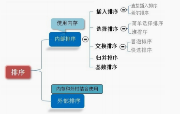

# 排序算法

## 0.概述




## 1.冒泡排序

​	冒泡排序是一种简单直观的排序算法。它重复的走访过要排序的数列，一次比较两个元素。

- 时间复杂度O(n²) 
- 空间复杂度O(1)

### 算法步骤

1. 比较相邻的元素。如果第一个比第二个大，就交换他们两个；
2. 对每一对相邻元素作同样工作，从开始第一对到结尾的最后一对。这一步做完后，最后的元素会是最大的数；
3. 针对所有的元素重复以上的步骤，除了最后一个。

### 动图演示


### 代码实现

```javascript
let swap = function (arr, from, to) {
    [arr[from], arr[to]] = [arr[to], arr[from]]
}

let judge = function (arr, a, b) {
    return arr[a] > arr[b]
}

let bubbleSort = arr => {
    let len = arr.length; //循环优化
    for (let i = 0; i < len - 1; i++) {
        for (let j = 0; j < len - 1 - i; j++) {
            if (judge(arr, j, j + 1)) { // 相邻元素两两对比
                swap(arr, j, j + 1) // 元素交换
            }
        }
    }
    return arr;
}

console.log(bubbleSort([1, 8, 4, 9, 2, 10, 0, -1]))
```


## 2.选择排序


- 时间复杂度O(n²) 
- 空间复杂度O(1)

### 算法步骤

1. 首先在未排序序列中找到最小（大）元素，存放到排序序列的起始位置；
2. 再从剩余未排序元素中继续寻找最小（大）元素，然后放到已排序序列的末尾；
3. 重复第二步，知道所有元素均排序完毕。

### 动图演示


### 代码实现

```javascript
let swap = function (arr, from, to) {
    [arr[from], arr[to]] = [arr[to], arr[from]]
}

let judge = function (arr, a, b) {
    return arr[a] > arr[b]
}

let selectionSort = arr => {
    let len = arr.length; //循环优化
    let minIndex;
    for (let i = 0; i < len - 1; i++) {
        minIndex = i;
        for (let j = i + 1; j < len; j++) {
            if (judge(arr, minIndex, j)) { // 寻找最小的数
                minIndex = j; // 将最小数的索引保存
            }
        }
        swap(arr, minIndex, i)
    }
    return arr;
}

console.log(selectionSort([1, 8, 4, 9, 2, 10, 0, -1]))
```


## 3.插入排序

​	类比揭扑克牌。它的原理是通过构建有序序列，对于未排序数据，在已排序序列中从后向前扫描，找到相应位置并插入。

- 时间复杂度O(n²) 
- 空间复杂度O(1)

### 算法步骤

1. 将待排序序列第一个元素看作一个有序序列，把第二个元素到最后一个元素当成未排序序列；
2. 从头到尾一次扫描未排序序列，将扫描到的每个元素插入有序序列的适当位置。（如果待插入的元素与有序序列中的某个元素相等，则将待插入元素插到相等元素的后面）

### 动图演示


### 代码实现

```javascript
let swap = function (arr, from, to) {
    [arr[from], arr[to]] = [arr[to], arr[from]]
}

let judge = function (arr, a, b) {
    return arr[a] > arr[b]
}

let insertionSort = arr => {
    let len = arr.length; //循环优化
    for (let i = 1; i < len; i++) {
        for (let j = i; j > 0; j--) {
            if (judge(arr, j - 1, j)) {
                swap(arr, j - 1, j)
            }
        }
    }
    return arr;
}

console.log(insertionSort([1, 8, 4, 9, 2, 10, 0, -1]))
```


## 4.希尔排序

希尔排序，也称递减增量排序算法，是插入排序的一种更高效的改进版本。但是希尔排序的**不稳定**排序算法。

希尔排序是基于插入排序的一下两点性质而提出改进方法的：

- 插入排序在对几乎已经排好序的数据操作时，效率高，即可以达到线性排序的效率；

- 但插入排序一般来说是低效的，因为插入排序每次只能将数据移动一位；

希尔排序的基本思想是：先将整个待排序的记录序列分割成若干个子序列分别进行直接插入排序，待整个序列中的记录**“基本有序”**时，再对全体记录进行一次直接插入排序。

- 时间复杂度O(nlogn)
- 空间复杂度O(1)

### 算法步骤

1. 选择一个增量序列 ti，tj，......，tk，其中，ti > tj，tk = 1;
2. 按增量序列个数 k ,对序列进行 k 趟排序；
3. 每趟排序，根据对应的增量 ti ,将待排序列分割成若干长度为 m 的子序列，分别对各子表进行直接插入排序。仅增量因子为1时，整个序列作为一个表来处理，表长度即为整个序列的长度。

### 动图演示


### 代码实现

```javascript
function shellSort(arr) {
    var len = arr.length,
        temp,
        gap = 1;
    while (gap < len / 3) { //动态定义间隔序列
        gap = gap * 3 + 1;
    }
    for (gap; gap > 0; gap = Math.floor(gap / 3)) {
        for (var i = gap; i < len; i++) {
            temp = arr[i];
            for (var j = i - gap; j >= 0 && arr[j] > temp; j -= gap) {
                arr[j + gap] = arr[j];
            }
            arr[j + gap] = temp;
        }
    }
    return arr;
}

console.log(shellSort([1, 8, 4, 9, 2, 10, 0, -1]))
```


## 5.归并排序

​	归并排序（Merge sort）是建立在归并操作上的一种有效的排序算法。该算法采用分治法（Divide and Conquer）的一个非常典型的应用。	

> 它的基本操作是：将已有的子序列合并，达到完全有序的序列；即先使每个子序列有序，再使子序列段间有序。
>
> 归并排序其实要做两件事：
>
> - 分解--将序列每次折半拆分
> - 合并--将划分后的序列段两两排序合并
>
> 因此，归并排序实际上就是两个操作，拆分+合并

​	作为一种典型的分而治之思想的算法应用，归并排序的实现有两种方法：

- 自上而下的递归
- 自下而上的迭代

​	和选择排序一样，归并排序的性能不受输入数据的影响，但表现比选择排序好的多，因为始终都是O(nlogn)的时间复杂度。代价是需要额外的内存空间。

​	

- 时间复杂度O(nlogn)
- 空间复杂度O(n)

### 算法步骤

1. 申请空间，使其大小为两个已经排序序列之和，该空间用来存放合并后的序列；
2. 设定两个指针，最初位置分别为两个已经排序序列的起始位置；
3. 比较两个指针所指向的元素，选择相对小的元素放入到合并空间，并移动指针到下一位置；
4. 重复步骤3知道某一指针达到序列尾；
5. 将零一序列剩下的所有元素直接复制到合并序列尾。

### 动图演示


### 代码实现

```javascript
function merge(left, right) {
    let result = []
    while (left.length > 0 && right.length > 0) {
        if (left[0] < right[0]) {
            /*shift()⽅法⽤于把数组的第⼀个元素从其中删除，并返回第⼀个元素的值。*/
            result.push(left.shift())
        } else {
            result.push(right.shift())
        }
    }
    return result.concat(left).concat(right)
}

function mergeSort(arr) {
    if (arr.length == 1) {
        return arr
    }
    let middle = Math.floor(arr.length / 2),
        left = arr.slice(0, middle),
        right = arr.slice(middle);
    return merge(mergeSort(left), mergeSort(right))
}

console.log(mergeSort([1, 8, 4, 9, 2, 10, 0, -1]))
```


## 6.快速排序

​	快速排序由于排序效率在同为O(N*logN)的几种排序方法中效率较高，因此经常被采用，再加上快速排序思想----分治法也确实实用。快速排序是一种既不浪费空间又可以快一点的排序算法。

​	快速排序的基本思想：挖坑填数+分治法 。

- 时间复杂度
- 空间复杂度

### 算法步骤

1. 先从数列中取出一个数作为“基准”；
2. 分区过程：将比这个“基准”大的数全放到“基准”的右边，小于或等于“基准”的数全放到“基准”的左边；
3. 再对左右区间重复第二步，直到各区间只有一个数。

### 动图演示


### 代码实现

```javascript
let quicksort = function (arr) {
    if (arr.length <= 1) return arr;
    let pivot = Math.floor((arr.length - 1) / 2);
    let val = arr[pivot],
        less = [],
        more = [];
    arr.splice(pivot, 1);
    arr.forEach(function (e, i, a) {
        e < val ? less.push(e) : more.push(e);
    });
    return (quicksort(less)).concat([val], quicksort(more))
}

console.log(quicksort([1, 8, 4, 9, 2, 10, 0, -1]))
```


## 7.堆排序

堆：本质是一种数据对象。特别重要的一点性质：任意的叶子节点小于（或大于）它所有的父节点。两者对左右孩子的大小关系不做任何要求。

堆排序 （Heapsort）是指利用堆这种数据结构所设计的一种排序算法。分为两种方法：

1. 大顶堆：每个节点的值都大于其子节点的值，在堆排序算法中用于升序排列；
2. 小顶堆：每个节点的值都小于其子节点的值，在堆排序算法中用于降序排列；

- 时间复杂度 Ο(nlogn)
- 空间复杂度

### 算法步骤

1. 将待排序列构建成一个堆H[0......n-1]，根据（升序降序需求）选择大顶堆或小顶堆；
2. 把堆首（最大值）和堆尾互换；
3. 把堆的尺寸缩小1，并调用 `shift_down(0)`，目的是把新的数组顶端数据调整到相应位置；
4. 重复步骤2-3，直到堆的尺寸为1。

### 动图演示


### 代码实现

```javascript
/** 
 * 堆排序
 * 从小到大
 */

var len; // 因为声明的多个函数都需要数据长度，所以把len设置成为全局变量

function buildMaxHeap(arr) { // 建立大顶堆
    len = arr.length;
    for (var i = Math.floor(len / 2); i >= 0; i--) {
        heapify(arr, i);
    }
}

function heapify(arr, i) { // 堆调整
    var left = 2 * i + 1,
        right = 2 * i + 2,
        largest = i;

    if (left < len && arr[left] > arr[largest]) {
        largest = left;
    }

    if (right < len && arr[right] > arr[largest]) {
        largest = right;
    }

    if (largest != i) {
        swap(arr, i, largest);
        heapify(arr, largest);
    }
}

function heapSort(arr) {
    buildMaxHeap(arr);

    for (var i = arr.length - 1; i > 0; i--) {
        swap(arr, 0, i);
        len--;
        heapify(arr, 0);
    }
    return arr;
}

let swap = function (arr, from, to) {
    [arr[from], arr[to]] = [arr[to], arr[from]]
}

console.log(heapSort([1, 8, 4, 9, 2, 10, 0, -1]))
```


## 8.计数排序

计数排序的核心在于将输入的数据值转化为键存储在额外开辟的数组空间中。作为一种线性时间复杂度的排序，计数排序要求输入的数据必须是有确定范围的**非负整数**

- 时间复杂度
- 空间复杂度

### 动图演示


### 代码实现

```javascript
function countingSort(arr, maxValue) {
    var bucket = new Array(maxValue + 1),
        sortedIndex = 0,
        arrLen = arr.length,
        bucketLen = maxValue + 1;

    for (var i = 0; i < arrLen; i++) {
        if (!bucket[arr[i]]) {
            bucket[arr[i]] = 0;
        }
        bucket[arr[i]]++;
    }

    for (var j = 0; j < bucketLen; j++) {
        while (bucket[j] > 0) {
            arr[sortedIndex++] = j;
            bucket[j]--;
        }
    }

    return arr;
}

console.log(countingSort([1, 8, 4, 9, 2, 10, 0], 10))
```


## 9.桶排序

桶排序是计数排序的升级版。它利用了函数的映射关系，高效与否的关键就在于这个映射函数的确定。为了使桶排序更加高效，我们需要做到这两点：

1. 在额外空间充足的情况下，尽量增大桶的数量；
2. 使用的映射函数能够将输入的 N 个数据均匀的分配到 k 个桶中。

同时，对于桶中元素的排序，选择何种比较排序算法对于性能的影响至关重要。

> 什么时候最快：当输入的数据可以均匀的分配到每一个桶中；
>
> 什么时候最慢：当输入的数据被分配到了同一个桶中；

- 时间复杂度
- 空间复杂度

### 代码实现

```javascript
/** 
 * 桶排序
 * 从小到大
 */
function bucketSort(arr, bucketSize) {
    if (arr.length === 0) {
        return arr;
    }

    var i;
    var minValue = arr[0];
    var maxValue = arr[0];
    for (i = 1; i < arr.length; i++) {
        if (arr[i] < minValue) {
            minValue = arr[i]; // 输入数据的最小值
        } else if (arr[i] > maxValue) {
            maxValue = arr[i]; // 输入数据的最大值
        }
    }

    //桶的初始化
    var DEFAULT_BUCKET_SIZE = 5; // 设置桶的默认数量为5
    bucketSize = bucketSize || DEFAULT_BUCKET_SIZE;
    var bucketCount = Math.floor((maxValue - minValue) / bucketSize) + 1;
    var buckets = new Array(bucketCount);
    for (i = 0; i < buckets.length; i++) {
        buckets[i] = [];
    }

    //利用映射函数将数据分配到各个桶中
    for (i = 0; i < arr.length; i++) {
        buckets[Math.floor((arr[i] - minValue) / bucketSize)].push(arr[i]);
    }

    arr.length = 0;
    for (i = 0; i < buckets.length; i++) {
        insertionSort(buckets[i]); // 对每个桶进行排序，这里使用了插入排序
        for (var j = 0; j < buckets[i].length; j++) {
            arr.push(buckets[i][j]);
        }
    }

    return arr;
}

let swap = function (arr, from, to) {
    [arr[from], arr[to]] = [arr[to], arr[from]]
}

let judge = function (arr, a, b) {
    return arr[a] > arr[b]
}

let insertionSort = arr => {
    let len = arr.length; //循环优化
    for (let i = 1; i < len; i++) {
        for (let j = i; j > 0; j--) {
            if (judge(arr, j - 1, j)) {
                swap(arr, j - 1, j)
            }
        }
    }
    return arr;
}

console.log(bucketSort([1, 8, 4, 9, 2, 10, 0, -1]))
```


## 10.基数排序

基数排序是一种非比较型整数排序算法，其原理是将整数按位数切割成不同的数字，然后按每个位数分别比较。由于整数也可以表达字符串（比如名字或日期）和特定格式的浮点数，所以基数排序也不是只能使用于整数。

- 时间复杂度
- 空间复杂度

### 算法步骤

通过序列中各个元素的值，对排序的N个元素进行若干趟的**“分配”**与**“收集”**来实现排序。

1. 分配：我们将L[i]中的元素取出（位数不够可补0），首先确定其各位上的数字，根据该数字分配到与之序号相同的桶中；
2. 收集：当序列中所有的元素都分配到对应的桶中，再按照顺序依次将桶中的元素收集形成新的一个待排序列L[i]；
3. 对新形成的序列L[i]，重复执行分配和收集元素中的十位、百位...直到分配完该序列中的最高位，则排序结束。

### 基数排序 vs 计数排序 vs 桶排序

这三种排序算法都利用了桶的概念，但对桶的使用方法上有明显差异：

- 基数排序：根据键值的每位数字来分配桶；
- 计数排序：每个桶只存储单一键值；
- 桶排序：每个桶存储一定范围的数值；

### 动图演示


### 代码实现

```javascript
/** 
 * 基数排序
 * 从小到大
 */


// LSD Radix Sort
// helper function to get the last nth digit of a number 
var getDigit = function (num, nth) {
    // get last nth digit of a number 
    var ret = 0;
    while (nth--) {
        ret = num % 10;
        num = Math.floor((num - ret) / 10)
    }
    return ret
}

// radixSort
function radixSort(arr) {
    var max = Math.floor(Math.log10(Math.max.apply(Math, arr))),
        // get the length of digits of the max value in this array 
        digitBuckets = [],
        idx = 0;
    for (var i = 0; i < max + 1; i++) {
        // rebuild the digit buckets according to this digit 
        digitBuckets = []
        for (var j = 0; j < arr.length; j++) {
            var digit = getDigit(arr[j], i + 1);
            digitBuckets[digit] = digitBuckets[digit] || [];
            digitBuckets[digit].push(arr[j]);
        }
        // rebuild the arr according to this digit
        idx = 0
        for (var t = 0; t < digitBuckets.length; t++) {
            if (digitBuckets[t] && digitBuckets[t].length > 0) {
                for (j = 0; j < digitBuckets[t].length; j++) {
                    arr[idx++] = digitBuckets[t][j];
                }
            }
        }
    }
    return arr
}

console.log(radixSort([1, 8, 4, 9, 2, 10, 0]))
```

